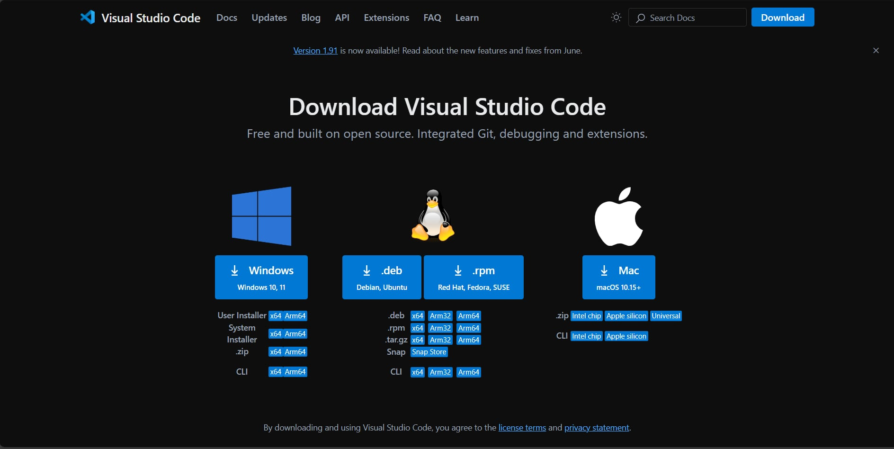
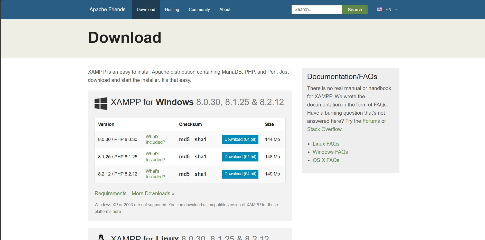
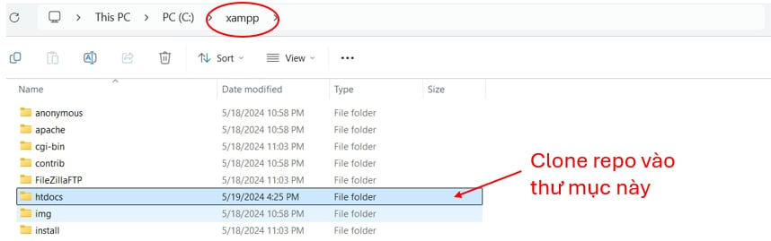
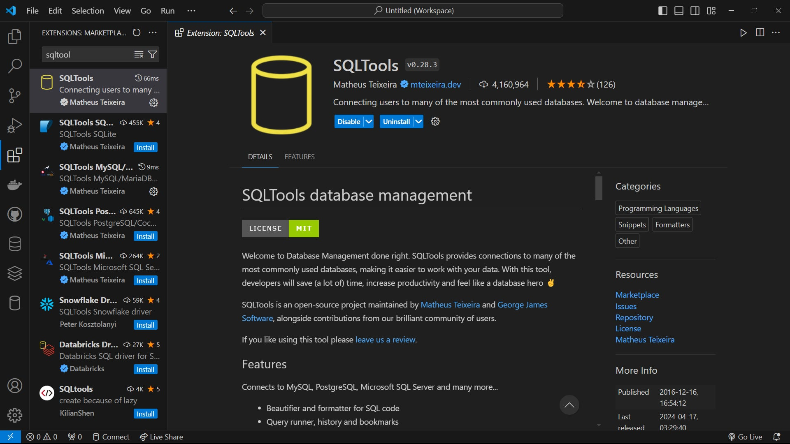
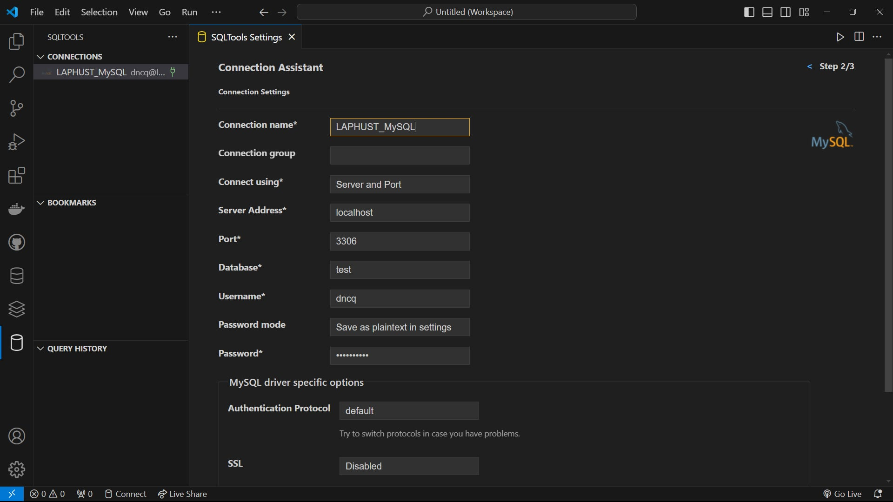
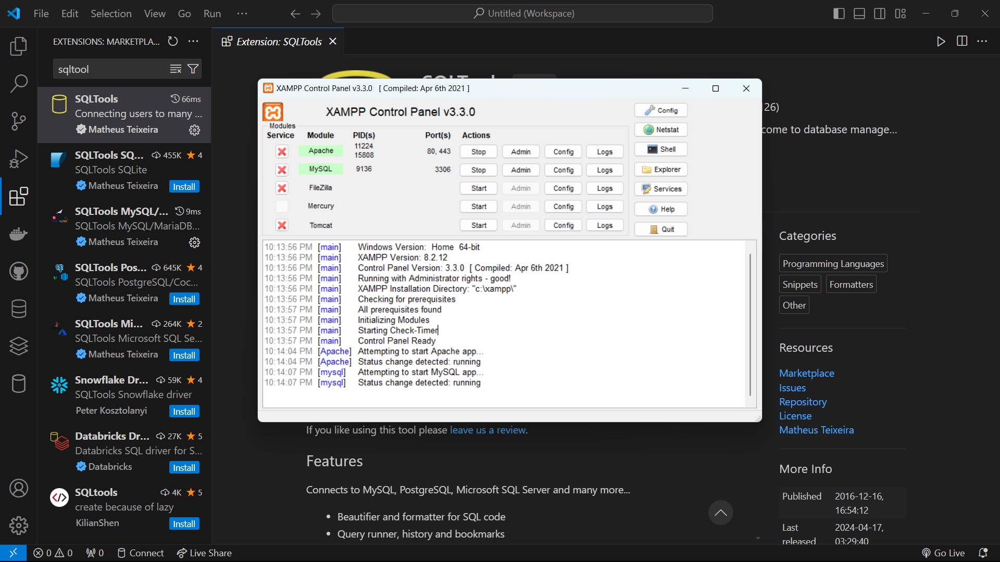

# Hướng dẫn cài đặt và sử dụng chương trình

Dưới đây là yêu cầu về thiết bị và hướng dẫn chi tiết cách cài đặt và chạy mã nguồn

## Yêu cầu
- Hệ điều hành: Windows 10 trở lên
- Trình duyệt: Google Chrome/ Microsoft Edge

## Các bước cài đặt

- Cài đặt Visual Studio Code: [link](https://code.visualstudio.com/Download)



- Cài đặt XAMPP để thiết lập và điều hành máy chủ nội bộ: [link](https://www.apachefriends.org/download.html)



- Clone repository về thiết bị local, kéo thả vào thư mục **htdocs** trong thư mục cài đặt xampp
```bash
git clone 'https://github.com/dncq/it3930E-project2.git'
```


- Cài đặt extension **SQLTools** trong Visual Studio Code



- Thiết lập kết nối với cơ sở dữ liệu với các thông tin như trong hình, thêm dữ liệu để chạy chương trình minh họa bằng cách chạy file **insert_data.sql** trong thư mục **database**.



## Khởi chạy chương trình
- Khởi động Apache và MySQL trên XAMPP



- Chạy file **index.php** để khởi chạy web, hoặc mở trình duyệt và nhập đường dẫn sau:

```bash
http://localhost/hustpc-website/php/index.php
```
